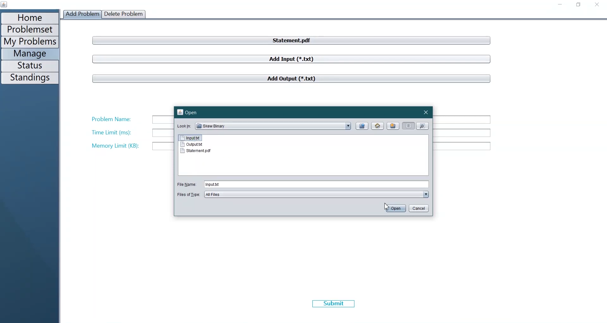
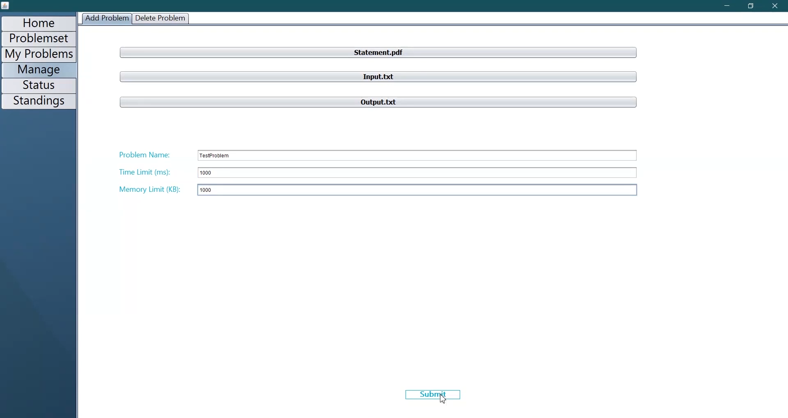
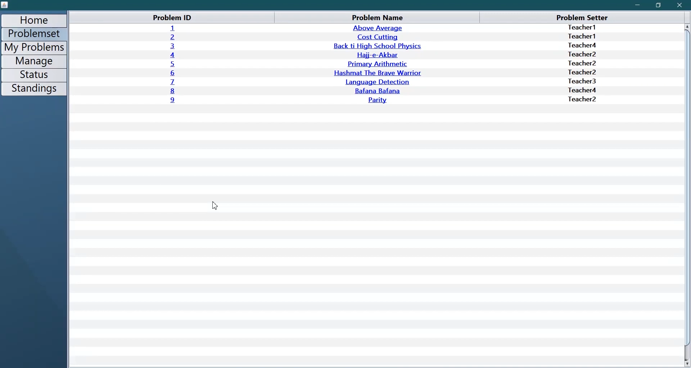
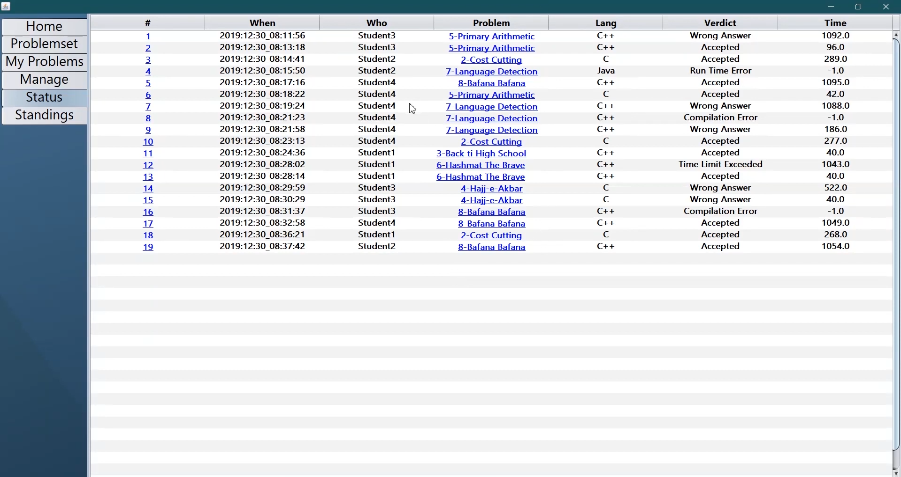
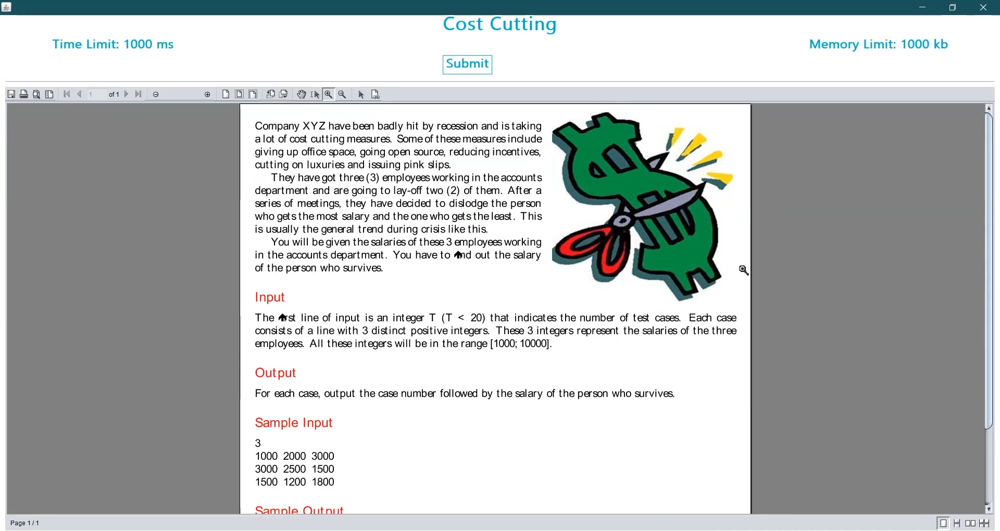
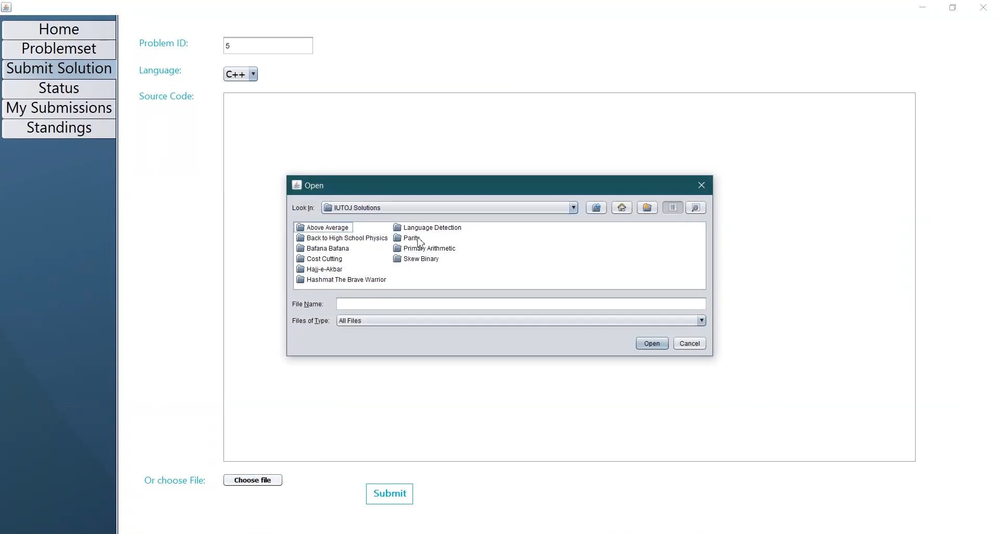
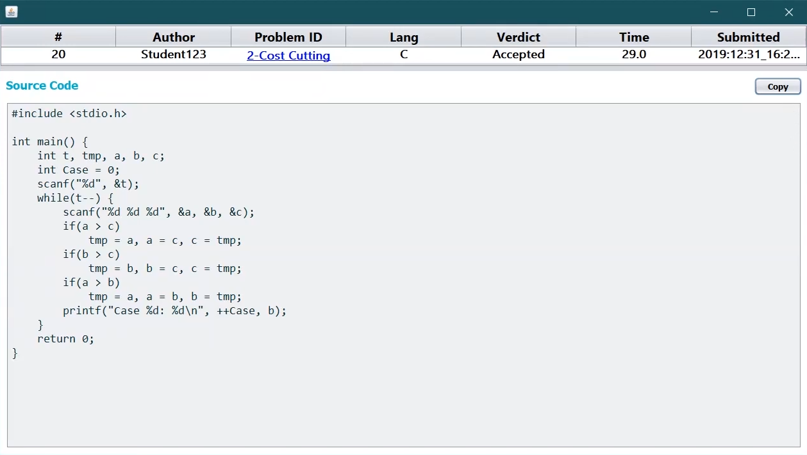

# IUTOJ

IUTOJ is an Offline Programming Judge that automatically evaluates submitted solutions to programming problems by compiling and executing code and testing with pre-constructed test cases.

## Developers
* [Kawsar Ahmed Bhuiyan](https://github.com/kawsarahmedbhuiyan)
* [Asaduzzaman Herok](https://github.com/ASADUZZAMAN-HEROK)

## Foreword
The main goal of this application is to increase the accuracy and efficiency in judging the solutions of problems submitted by the students in classes of Programming Lab Courses.

## Features

### Sign Up/Login:

### Add Problems:
Admins can add a new problem by providing the Problem Statement, the inputs and the expected outputs.

### View Problemset:
Both students and admin can see the list of all the problems.

### View Status of All Students:

### View Standings:

### View Problem:
Problem Statement, Time Limit and Memory Limit of each Problem can be viewed.

### Submit Solution:
Students can navigate to the Submit Solution tab and submit their source codes. They can choose to directly paste their code in the blank text area or upload the .c, .cpp or .java file.

### View Solution:

Live Demonstration: https://youtu.be/XkwRbjgea5Q
